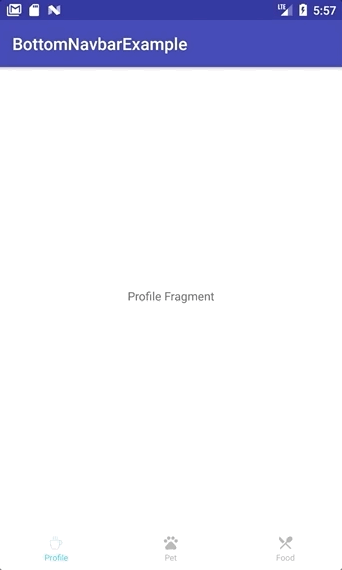

# Lottie Bottom Navbar

A customisable bottom navigation bar with Lottie Animation

## Current Latest Version `1.1.6`
What's new:
- Update Gradle minsdk version to support sdk v19



# Usage

### Add maven url Inside **Project Level build.gradle**
```bash
buildscript {
	...
    repositories {
    	...
        maven {
            url  "https://dl.bintray.com/subsub/maven"
        }
    }
    dependencies {
    	...
    }
}

...

allprojects {
    repositories {
    	...
        maven {
            url  "https://dl.bintray.com/subsub/maven"
        }
    }
}
```

### Add dependency into your app build.gradle
```bash
implementation "com.subkhansarif.libs:bottomnavbarlib:{latestVersion}"
```

# Sample

See sample project.

### Add LottieBottomNavbar to your layout
```xml
<com.subkhansarif.bottomnavbar.LottieBottomNavbar
        android:id="@+id/bottom_navbar"
        android:layout_width="match_parent"
        android:layout_height="match_parent"
        android:elevation="15dp"
        android:orientation="vertical"
        app:activeButtonColor="@color/colorWhite"
        app:buttonColor="@color/colorAccent"
        app:buttonContainerBackgroundColor="@color/colorWhite"
        app:buttonsHeight="56dp"
        app:layout_constraintBottom_toBottomOf="parent"
        app:layout_constraintEnd_toEndOf="parent"
        app:layout_constraintStart_toStartOf="parent"
        app:layout_constraintTop_toTopOf="parent"
        app:offscreenPageLimit="4"
        app:setViewPagerSwipeable="false"
	app:navbarElevation="15dp"
        app:viewPagerBackground="@color/colorWhite" />
```

### Setup menus for navbar
```java
ArrayList<BottomMenu> menu = ArrayList();
menu.add(new BottomMenu(0L, new ProfileFragment(), getString(R.string.lbl_menu_profile), R.drawable.ic_person_grey, "a_cup_of_coffee.json"));
menu.add(new BottomMenu(1L, new PetFragment(), getString(R.string.lbl_menu_pet), R.drawable.ic_pets_grey, "a_cup_of_coffee.json"));
menu.add(new BottomMenu(2L, new FoodFragment(), getString(R.string.lbl_menu_Food), R.drawable.ic_restaurant_menu_grey, null));
```
BottomMenu constructor parameters:
- `id: Long`, id for your button
- `fragment: Fragment`, fragment for this button
- `label: String`, label for this button. This will be shown below button icon
- `icon: drawable res`, image resource for this button
- `(optional) lottie_animation: String`, a String of json file name for Lottie Animation.

### Add menus to navbar
```java
LottieBottomNavbar bottom_navbar = findViewById(R.id.bottom_navbar)
bottom_navbar.setFragmentManager(getSupportFragmentManager())
bottom_navbar.setMenu(menu)
bottom_navbar.setSelected(1)
bottom_navbar.setMenuClickListener(this)
```

### Layout Properties
Name | Type | Description
--- | --- | ---
`buttonContainerBackgroundColor` | Color | Navbar background color
`buttonsHeight` | Dimension | Navbar Height
`itemCount` | Int | How many buttons in the Navbar, this value will be overriden when `setMenu()` is called
`offscreenPageLimit` | Int | Set how many hidden fragment will be keep in memory. This is the same as `ViewPager.OffscreenPageLimit()`.
`setViewPagerSwipeable` | Boolean | If set to false, the viewpager will be un-swipeable
`viewPagerBackground` | Color | The background color of the viewpager
`activeButtonColor` | Color | Color for the selected button, this affect text and image tint, but won't affect to Lottie animation image color.
`buttonColor` | Color | Default color for when button is not selected
`navbarElevation` | Dimension | Elevation for navigation bar
